# Tutorial on logical model simulation

In this tutorial, we use a [model of early steps of metastasis](http://journals.plos.org/ploscompbiol/article?id=10.1371/journal.pcbi.1004571) to illustrate the pipeline. 

All scripts and tools are provided at: [https://github.com/sysbio-curie/Logical_modelling\_pipeline](https://github.com/sysbio-curie/Logical_modelling_pipeline) 

All tools can be run in your CentOS/MacOS/Windows machine or you can download our Docker container that allows the completion of the present tutorial at the dedicated [Docker Hub webpage](https://hub.docker.com/r/arnaumontagud/logical_modelling_pipeline/).


All command lines and steps to follow to process the results are described in this tutorial. The same steps can be used for any other Boolean models.

*Disclaimer: we will keep updating the tutorial in the github as the different tools used evolve.* 

*Note: the scripts used in this tutorial are tailored for the Cohen et al example. Only small changes are needed in the provided files to fit a new model. Another example of the use of the pipeline is presented [using Flobak et al model](https://github.com/sysbio-curie/Logical_modelling_pipeline/blob/master/doc/Tutorial_Flobak.md).*

## Table of contents
1. [Material and methods used in the pipeline](#1-material-and-methods-used-in-the-pipeline)
1. [Constructing the Metastasis model network](#2-constructing-the-model-network)
	1. [Metastasis model as a test case](#metastasis-model-as-a-test-case)
1. [Translation of the network into a mathematical model](#3-translation-of-the-network-into-a-mathematical-model)
	1. [MaBoSS simulations](#maboss-simulations)
1. [Analysing stable solutions](#4-analysis-of-stable-solutions)
	1. [Principal component analysis](#principal-component-analysis)
	1. [Displaying asymptotic solutions](#displaying-asymptotic-solutions)
1. [Model reduction](#5-model-reduction)
	1. [Masking nodes reduction using GINsim](#1-masking-nodes-reduction-using-ginsim)
	1. [Modular reduction using BiNoM](#2-modular-reduction-using-binom)
1. [Mutant analysis](#6-mutant-analysis)
	1. [Predicting genetic interactions](#2-predicting-genetic-interactions) 
		1. [Robustness analysis of genetic interactions with respect to the phenotype probability](#robustness-analysis-of-logical-gates-with-respect-to-the-phenotype-probability)
	1. [Robustness analysis of logical gates](#3-robustness-analysis-of-logical-gates)
		1. [Robustness analysis of logical gates with respect to the phenotype probability](#robustness-analysis-of-logical-gates-with-respect-to-the-phenotype-probability)
		1. [Robustness analysis of logical gates with respect to the stable states](#robustness-analysis-of-logical-gates-with-respect-to-the-stable-states)
1. [Using the model as a scaffold for data integration](#7-using-the-model-as-a-scaffold-for-data-integration)
	1. [Mapping data onto modular network using ROMA](#mapping-data-onto-modular-network-using-roma)
1. [Using data as priors of model construction](#8-using-data-as-priors-of-model-construction)
	1. [Identifying interesting modules from data with ROMA](#identifying-interesting-modules-from-data-with-roma)
	1. [Prioritization of genes for constructing the model with Lemon-Tree](#prioritization-of-genes-for-constructing-the-model-with-lemon-tree)


## 1. Material and methods used in the pipeline

* Software: 
	* [Cytoscape v2](http://chianti.ucsd.edu/Cyto-2_8_3/)
	* [GINSim](http://ginsim.org/downloads)
	* [Cygwin](https://cygwin.com/install.html) needed to use MaBoSS under Windows
	* [R project](https://cloud.r-project.org/) used for data analysis (for convenience [RStudio](https://www.rstudio.com/products/rstudio/download/) is recommended)
	
	
* Provided tools:
	* [BiNoM](http://binom.curie.fr/)
	* [MaBoSS](http://maboss.curie.fr/)
	* [ROMA](https://github.com/sysbio-curie/Roma)
	* [ViDaExpert](http://bioinfo-out.curie.fr/projects/vidaexpert/)
	* [Lemon-Tree](https://github.com/eb00/lemon-tree)

* Scripts: 
[Folder with provided files](https://github.com/sysbio-curie/Logical_modelling_pipeline/tree/master/scripts)

* GINsim model and Cytoscape network files: 
[Folder with provided files](https://github.com/sysbio-curie/Logical_modelling_pipeline/tree/master/models)

* Docker container: [Docker hub site](https://hub.docker.com/r/arnaumontagud/logical_modelling_pipeline/) to pull and run the container with all tools needed to run the tutorial using Unix scripts and where its usage is explained.

## 2. Constructing the model network

The desired level of description of the processes we wish to explore directs the choice of the type of networks that is most appropriate to the biological question. If the biochemistry is well known, biochemical reaction-based networks will be used. If only activation or inhibition of one protein onto the other is known without the details of the influences, then an influence network will be built.

To build our networks, we conform to the standard rules of the community, SBGN (ref 1 and 2), which are of three kinds: Entity Relations (ER), Process Diagrams (PD) and Activity Flow (AF). Over the years, we have been using mainly AF when the information was not very detailed and PD for cases where mechanistic processes were needed to answer the biological question (cf. ACSN: [https://acsn.curie.fr/](https://acsn.curie.fr/)). 

In the particular case of this tutorial, the process started by gathering information on the signalling pathway of interest: migration and related ones on one side and apoptosis-related on the other side. Information was gathered on the relevant players of these pathways and how they were related: which protein activated which proteins and how they accomplished their signalling goals. It may be the case that researchers find themselves in a situation where different papers yields contradictory information on a given element of the network. In this case, both caution and annotation are key. Some interactions that might not make sense on the close-up view might reveal their rationale when more information about the context is added to the picture.

### Definition of the logical rules

A logical rule is defined for each of the nodes of the network. The nodes can take two values, 0 or 1, and the rules are set to define the conditions for updating the node values. For a better description of the vocabulary and the methods to set the rules, we refer the user to the supplementary material: Logical\_modelling\_Glossary.

### Metastasis model as a test case

As an example, we use a model that describes the signalling and regulation of EMT and Metastasis in cancer cells (ref 3). This model comprises 32 nodes and 157 edges; has two inputs, *ECMicroenv* and *DNAdamage* and 6 outputs: *ECM*, *Invasion*, *Migration*, *Metastasis*, *Apoptosis* and *CellCycleArrest*.

The model is able to predict conditions, e.g. single or double mutations, favourable (or unfavourable) to tumour invasion and migration to the blood vessels in response to two inputs, extracellular matrix signalling (*ECMicroenv*) and DNA damage presence (*DNAdamage*). 


The network with 32 nodes and 157 edges in GINsim.
The model name is: Metastasis\_Master\_Model.zginml


The modular network with 20 nodes and 93 edges in GINsim.
The model name is: Metastasis\_Module\_Model.zginml

Some of the genes were bundled in functional modules in order to test several techniques that we will describe here and were partly described in the initial publication of this model. The pathways included in this model are represented by one or two components of these pathways, e.g TGFB1 and SMADs for *TGFbeta*; Twist1, Snai1, Snai2, Zeb1, Zeb2 and Vim for *EMT*; miR203, miR200 and miR34a for *miRNA*, etc. 

This model has been the object of continuous work from several researchers who have gathered data from literature and have thoroughly validated it with experiments and single and double mutant data ([ref 3](https://www.ncbi.nlm.nih.gov/pubmed/26528548)). 

In this model, no cyclic attractors were found for the wild type cases.

The pipeline will be run on this example. Note that for other models, we anticipate that not all functions presented here will be appropriate. For instance, for models with cyclic attractors, the PCA representation of the stable states might be less interesting that in our current example. 

We have also worked with another model that represents the cell fate decision network in the AGS gastric cancer cell line, with 75 signaling and regulatory components (ref 4), the tutorial for which can be found [here](https://github.com/sysbio-curie/Logical_modelling_pipeline/blob/master/doc/Tutorial_Flobak.md).

## 3. Translation of the network into a mathematical model

The network has been built with connections among nodes describing the type of influences (positive or negative), described in the annotation box of each node. This information can be traced, updated and corrected at any time.

### The logical model in GINsim

GINsim [paper](https://www.ncbi.nlm.nih.gov/pubmed/22144167) and [webpage](http://ginsim.org/) can inform easily on all stable states of the model, the functionality of positive and negative circuits, or propose reduced models. 

GINsim can easily find and show all stable states:

<p align="center">
<br>
</p>

And generate a table of all stable states:

<p align="center">
<br>
</p>

GINsim can also find all positive and negative circuits. For this, we use the reduced model obtained in the process explained in the "Model reduction" part and also in Cohen et al. The reason for this is that GINsim cannot deal with the functionality analysis of the original model because of its size:

<p align="center">
<br>
</p>

A window pops up:

<p align="center">
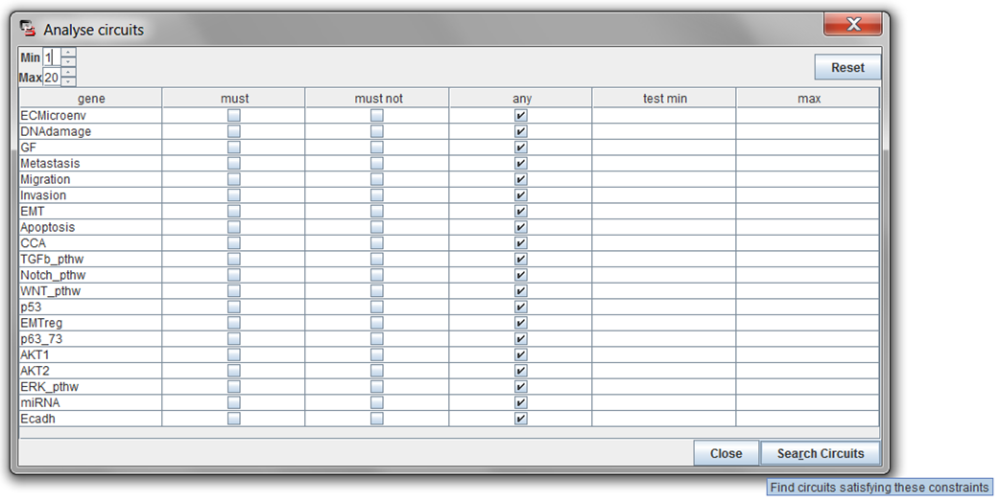<br>
</p>

Some choices of whether to include some nodes or not in the analysis of circuits can be made. For more information about GINsim, visit the webpage: http://ginsim.org/

The *Search Circuits* function retrieves:

<p align="center">
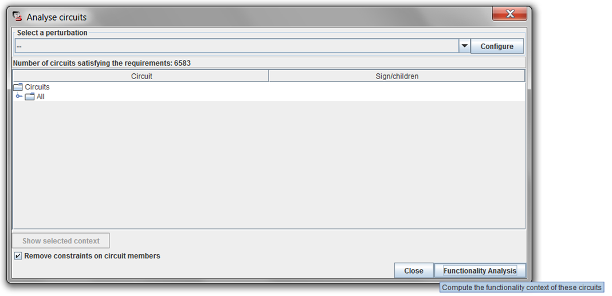<br>
</p>

Here one can perform a *Functionality Analysis* of wild type strain in order to analyse its functional circuits, and retrieve a window such as:

<p align="center">
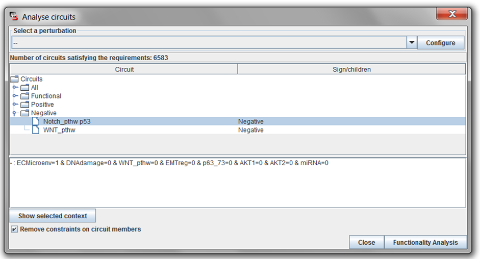<br>
</p>

Positive and Negative circuits can be browsed and studied. The latter is especially interesting to detect and analyse limit cycles, that are usually caused by negative feedback loops.

This analysis can also be performed on strains with a given perturbation, such as knock-outs (KO) and overexpression (E1), or a combination of perturbations:

<p align="center">
<br>
</p>

This way, we can browse if a given perturbation is responsible, for instance, for the appearance or disappearance of a limit cycle.

### The logical model in MaBoSS

Next, we use MaBoSS software because our goal is to simulate our logical model using discrete time Markov chain. In order to do this, we can take advantage of GINsim export ability to build the files that MaBoSS needs to simulate: a BND file for model definition and a CFG file for setting up the parameters of simulation.

GINsim is used here at first for his user friendly graphical interface, its facility to display equations and diverse interesting analyses that can be made on the network. 

However, any software that complies with SBML qual format could be used in theory. Note that the logical model could also directly be written using MaBoSS grammar.

GINsim export in MaBoSS format is straightforward:

<p align="center">
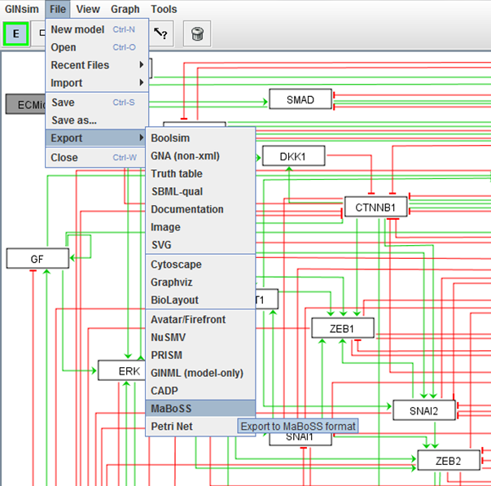<br>
</p>


Models from GINsim can be exported in MaBoSS format. Two files are created: a BND file with the description of the network and its connections among nodes and a CFG file with the configuration parameters needed for the simulations. We call this files ginsimout.bnd and ginsimout.bnd.cfg. (you can rename the latter file: ginsimout.cfg).

### MaBoSS simulations

MaBoSS is a C++ software (ref 5 and 6) for simulating continuous/discrete time Markov processes, defined on the state transition graph describing the dynamics of a Boolean network and can output probabilities of activation for each state of the model. This allows quantification of genetic perturbation and epistatic studies: simulation results do not shift from one stable state to another but rather 40% of the simulations shift from one stable state to another. 

In order to have these software running, we need its source code that can be downloaded from [webpage](http://maboss.curie.fr/) (also available from the tutorial `/lib` folder) and compile it on a UNIX machine. MaBoSS requires the packages flex and bison. 

There are several options to use MaBoSS, you can download the software, install the executable of MaBoSS in the folder containing your model files and run it from the same folder. For your convenience, you can also choose to use MaBoSS environment. For that, you need to follow the instructions on the *Installation* page of MaBoSS for a better use of MaBoSS environment.

In a terminal, go to the MaBoSS environment folder (in `/lib` folder of the pipeline if you have installed it there). Type:

	source MaBoSS.env

It is important that you stay in the same terminal. Then you can run MaBoSS from any other folder containing your model files.

To run the wild type condition (with no modifications from the initial model), you need to change some simulation parameters in the CFG file exported from GINsim.

* reduce max time from 1000 to 30

* initial conditions: all variables are set to 0 except inputs. Note that in the default, everything is set to 0

* add "is\_internal=1" to all variables. You can change the variables you wish to see in the outputs as 1. These variables are usually phenotypes or read-outs, or important variables whose activity you wish to follow.

* For our simulations, we set:

```

	ECMicroenv.is\_internal=1;
	DNAdamage.is\_internal=1;
	Metastasis.is\_internal=0;
	Migration.is\_internal=0;
	Invasion.is\_internal=0;
	EMT.is\_internal=0;
	Apoptosis.is\_internal=0;
	CellCycleArrest.is\_internal=0;
	GF.is\_internal=1;
	TGFbeta.is\_internal=1;
	p21.is\_internal=1;
	CDH1.is\_internal=1;
	CDH2.is\_internal=1;
	VIM.is\_internal=1;
	TWIST1.is\_internal=1;
	SNAI1.is\_internal=1;
	SNAI2.is\_internal=1;
	ZEB1.is\_internal=1;
	ZEB2.is\_internal=1;
	AKT1.is\_internal=1;
	DKK1.is\_internal=1;
	CTNNB1.is\_internal=1;
	NICD.is\_internal=1;
	p63.is\_internal=1;
	p53.is\_internal=1;
	p73.is\_internal=1;
	miR200.is\_internal=1;
	miR203.is\_internal=1;
	miR34.is\_internal=1;
	AKT2.is\_internal=1;
	ERK.is\_internal=1;
	SMAD.is\_internal=1;
```

For your convenience, we have also provided a script that use the information of inputs and outputs in order to have a complete run of the different phenotypes using MaBoSS. First you need to define define the outputs of the model in the file `listOut.txt` and the inputs in file `listIn.txt`, one output or input per line. Then you need to run this script using: 

	BND_CFG_modif.sh
	
The script changes these files (with the new parameters for simulating mutants that we will use in following sections) and keeps the original ones with original suffix: ginsimout\_original.bnd and ginsimout\_original.cfg. The script also optimizes the simulation parameter values (maximum number of steps, number of trajectories, etc.).


#### For Linux and Mac users

To simulate the model using MaBoSS, make sure the MaBoSS executable, the script and the model files are in the same folder type:

	./MBSS_FormatTable.pl ginsimout.bnd ginsimout.cfg

Or if you run it from the MaBoSS environment, simply type:

	MBSS_FormatTable.pl ginsimout.bnd ginsimout.cfg
	
Or, for completeness, you can also run it with following script:

	run_MaBoSS_Unix.sh ginsimout.bnd ginsimout.cfg

#### For Windows users (under Cygwin)

If you are using Windows, you can use our executable in the lib folder of our Github repository ([https://github.com/sysbio-curie/Logical_modelling_pipeline/tree/master/lib](https://github.com/sysbio-curie/Logical_modelling_pipeline/tree/master/lib)) using the script:

	./run_MaBoSS_CygWin.sh

If you do not have perl installed on your Cygwin environment, you can use the script: 

	./run_MaBoSS_CygWin_noPerl.sh

Or, for completeness, you can also run it with MaBoSS environment files. Copy Windows MaBoSS executable (from `MaBoSS-env-2.0/binaries/win-x86`) and MBSS_FormatTable.pl (from `/MaBoSS-env-2.0/tools`) and copy them to the local folder `/scripts/1 run MaBoSS`:

	./MBSS_FormatTable.pl ginsimout.bnd ginsimout.cfg

Note that some changes can be made in the CFG file for a faster and more comprehensive Windows run: unabling multi-threads, reducing sample_count and time_tick.

	sed -i 's/thread_count = 4/thread_count = 1/' ginsimout.cfg

#### For all users

This launching script generates a folder with the BND and CFG files as well as the resulting files with the same prefix as the BND and CFG files. The first and second scripts use a Perl script to organise the results. If you do not have a Perl interpreter, you can use the third script. The resulting files are: 

* FP file, where all fixed points are described

* probtraj file, with all the network state probabilities on a time window, the entropy, the transition entropy and the Hamming distance distribution

* probtraj\_table file, which is the previous file rearranged for better use

* run TXT file, with a summary of the MaBoSS simulation run 

* statdist file, with stationary distribution characterizations

* statdist\_table file, which is the previous file rearranged for better use

## 4. Analysis of stable solutions

### Principal component analysis

In both GINsim and MaBoSS, a table of stable states that displays all possible combinations of system’s inputs and its stable outputs can be obtained: 

<p align="center">
<br>
</p>

This table can be analysed and studied as it is, even more if the model is small-scale and one has a deep knowledge of it. Furthermore, other exploratory analyses can be applied on these results, such as Principal Component Analysis, (PCA). To do this, we need to obtain the table of stable states as a matrix, which can be obtained from the FP output file of MaBoSS run. PCA can then be applied to this matrix in order to identify with variable changes (node’s values in our case) causes that model states change from one stable solution to another. 

In our case, the matrix is:

<table>
  <tr>
    <td>FP</td>
    <td>#1</td>
    <td>#2</td>
    <td>#3</td>
    <td>#4</td>
    <td>#5</td>
    <td>#6</td>
    <td>#7</td>
    <td>#8</td>
    <td>#9</td>
  </tr>
  <tr>
    <td>Probability</td>
    <td>0.20274</td>
    <td>0.10306</td>
    <td>0.13182</td>
    <td>0.07966</td>
    <td>0.1154</td>
    <td>0.04718</td>
    <td>0.01508</td>
    <td>0.24886</td>
    <td>0.05498</td>
  </tr>
  <tr>
    <td>ECMicroenv</td>
    <td>0</td>
    <td>0</td>
    <td>0</td>
    <td>1</td>
    <td>1</td>
    <td>0</td>
    <td>0</td>
    <td>1</td>
    <td>1</td>
  </tr>
  <tr>
    <td>DNAdamage</td>
    <td>0</td>
    <td>1</td>
    <td>1</td>
    <td>1</td>
    <td>1</td>
    <td>0</td>
    <td>1</td>
    <td>0</td>
    <td>1</td>
  </tr>
  <tr>
    <td>Migration</td>
    <td>0</td>
    <td>0</td>
    <td>0</td>
    <td>0</td>
    <td>0</td>
    <td>0</td>
    <td>0</td>
    <td>1</td>
    <td>1</td>
  </tr>
  <tr>
    <td>Metastasis</td>
    <td>0</td>
    <td>0</td>
    <td>0</td>
    <td>0</td>
    <td>0</td>
    <td>0</td>
    <td>0</td>
    <td>1</td>
    <td>1</td>
  </tr>
  <tr>
    <td>Invasion</td>
    <td>0</td>
    <td>0</td>
    <td>0</td>
    <td>0</td>
    <td>0</td>
    <td>0</td>
    <td>0</td>
    <td>1</td>
    <td>1</td>
  </tr>
  <tr>
    <td>EMT</td>
    <td>0</td>
    <td>0</td>
    <td>0</td>
    <td>0</td>
    <td>0</td>
    <td>1</td>
    <td>1</td>
    <td>1</td>
    <td>1</td>
  </tr>
  <tr>
    <td>VIM</td>
    <td>0</td>
    <td>0</td>
    <td>0</td>
    <td>0</td>
    <td>0</td>
    <td>1</td>
    <td>1</td>
    <td>1</td>
    <td>1</td>
  </tr>
  <tr>
    <td>AKT1</td>
    <td>0</td>
    <td>0</td>
    <td>0</td>
    <td>0</td>
    <td>0</td>
    <td>0</td>
    <td>0</td>
    <td>0</td>
    <td>0</td>
  </tr>
  <tr>
    <td>p63</td>
    <td>0</td>
    <td>1</td>
    <td>0</td>
    <td>1</td>
    <td>0</td>
    <td>0</td>
    <td>0</td>
    <td>0</td>
    <td>0</td>
  </tr>
  <tr>
    <td>miR200</td>
    <td>0</td>
    <td>1</td>
    <td>1</td>
    <td>1</td>
    <td>1</td>
    <td>0</td>
    <td>0</td>
    <td>0</td>
    <td>0</td>
  </tr>
  <tr>
    <td>AKT2</td>
    <td>0</td>
    <td>0</td>
    <td>0</td>
    <td>0</td>
    <td>0</td>
    <td>1</td>
    <td>1</td>
    <td>1</td>
    <td>1</td>
  </tr>
  <tr>
    <td>ERK</td>
    <td>0</td>
    <td>0</td>
    <td>0</td>
    <td>0</td>
    <td>0</td>
    <td>1</td>
    <td>1</td>
    <td>1</td>
    <td>1</td>
  </tr>
  <tr>
    <td>CDH2</td>
    <td>0</td>
    <td>0</td>
    <td>0</td>
    <td>0</td>
    <td>0</td>
    <td>1</td>
    <td>1</td>
    <td>1</td>
    <td>1</td>
  </tr>
  <tr>
    <td>CTNNB1</td>
    <td>0</td>
    <td>0</td>
    <td>0</td>
    <td>0</td>
    <td>0</td>
    <td>0</td>
    <td>0</td>
    <td>0</td>
    <td>0</td>
  </tr>
  <tr>
    <td>SMAD</td>
    <td>0</td>
    <td>0</td>
    <td>0</td>
    <td>0</td>
    <td>0</td>
    <td>0</td>
    <td>0</td>
    <td>1</td>
    <td>1</td>
  </tr>
  <tr>
    <td>CDH1</td>
    <td>1</td>
    <td>1</td>
    <td>1</td>
    <td>1</td>
    <td>1</td>
    <td>0</td>
    <td>0</td>
    <td>0</td>
    <td>0</td>
  </tr>
  <tr>
    <td>ZEB2</td>
    <td>0</td>
    <td>0</td>
    <td>0</td>
    <td>0</td>
    <td>0</td>
    <td>1</td>
    <td>1</td>
    <td>1</td>
    <td>1</td>
  </tr>
  <tr>
    <td>p53</td>
    <td>0</td>
    <td>0</td>
    <td>1</td>
    <td>0</td>
    <td>1</td>
    <td>0</td>
    <td>0</td>
    <td>0</td>
    <td>0</td>
  </tr>
  <tr>
    <td>p73</td>
    <td>0</td>
    <td>1</td>
    <td>0</td>
    <td>1</td>
    <td>0</td>
    <td>0</td>
    <td>0</td>
    <td>0</td>
    <td>0</td>
  </tr>
  <tr>
    <td>miR34</td>
    <td>0</td>
    <td>0</td>
    <td>0</td>
    <td>0</td>
    <td>0</td>
    <td>0</td>
    <td>0</td>
    <td>0</td>
    <td>0</td>
  </tr>
  <tr>
    <td>Apoptosis</td>
    <td>0</td>
    <td>1</td>
    <td>1</td>
    <td>1</td>
    <td>1</td>
    <td>0</td>
    <td>0</td>
    <td>0</td>
    <td>0</td>
  </tr>
  <tr>
    <td>p21</td>
    <td>0</td>
    <td>1</td>
    <td>1</td>
    <td>1</td>
    <td>1</td>
    <td>0</td>
    <td>0</td>
    <td>0</td>
    <td>0</td>
  </tr>
  <tr>
    <td>miR203</td>
    <td>0</td>
    <td>0</td>
    <td>1</td>
    <td>0</td>
    <td>1</td>
    <td>0</td>
    <td>0</td>
    <td>0</td>
    <td>0</td>
  </tr>
  <tr>
    <td>CellCycleArrest</td>
    <td>0</td>
    <td>1</td>
    <td>1</td>
    <td>1</td>
    <td>1</td>
    <td>1</td>
    <td>1</td>
    <td>1</td>
    <td>1</td>
  </tr>
  <tr>
    <td>GF</td>
    <td>0</td>
    <td>0</td>
    <td>0</td>
    <td>0</td>
    <td>0</td>
    <td>1</td>
    <td>1</td>
    <td>1</td>
    <td>1</td>
  </tr>
  <tr>
    <td>NICD</td>
    <td>0</td>
    <td>0</td>
    <td>0</td>
    <td>0</td>
    <td>0</td>
    <td>0</td>
    <td>0</td>
    <td>1</td>
    <td>1</td>
  </tr>
  <tr>
    <td>TGFbeta</td>
    <td>0</td>
    <td>0</td>
    <td>0</td>
    <td>1</td>
    <td>1</td>
    <td>0</td>
    <td>0</td>
    <td>1</td>
    <td>1</td>
  </tr>
  <tr>
    <td>TWIST1</td>
    <td>0</td>
    <td>0</td>
    <td>0</td>
    <td>0</td>
    <td>0</td>
    <td>1</td>
    <td>1</td>
    <td>1</td>
    <td>1</td>
  </tr>
  <tr>
    <td>SNAI1</td>
    <td>0</td>
    <td>0</td>
    <td>0</td>
    <td>0</td>
    <td>0</td>
    <td>1</td>
    <td>1</td>
    <td>1</td>
    <td>1</td>
  </tr>
  <tr>
    <td>SNAI2</td>
    <td>0</td>
    <td>0</td>
    <td>0</td>
    <td>0</td>
    <td>0</td>
    <td>1</td>
    <td>1</td>
    <td>1</td>
    <td>1</td>
  </tr>
  <tr>
    <td>ZEB1</td>
    <td>0</td>
    <td>0</td>
    <td>0</td>
    <td>0</td>
    <td>0</td>
    <td>1</td>
    <td>1</td>
    <td>1</td>
    <td>1</td>
  </tr>
  <tr>
    <td>DKK1</td>
    <td>0</td>
    <td>0</td>
    <td>0</td>
    <td>0</td>
    <td>0</td>
    <td>0</td>
    <td>0</td>
    <td>1</td>
    <td>1</td>
  </tr>
</table>


Note that the numbers of the stable states can be renamed with the phenotypes to which they are associated.

We have used R environment to perform the PCA analysis with FactoMineR package. PCA usually retrieves two plots: individual factor dot plot and variable’s vectors. These plots can be displayed in separate graphs or together, correctly implying that the vectors cause the individual factor landscape.

Then, we run the R code found in file `PCA_on_FixedPoints.R` that uses PCA function from FactoMineR package. You can use the default FactoMineR graphs, or you can merge them in one single graph, all in this R script. Note that to get a figure like Figure 1, you will need to make a first PCA plot, analyse results and then change parts of the phenotype names to adapt the code to your specific model.

The PCA plot in Figure 1 shows a first dimension (with 62.48% of variability explained) dominated by an axis of CDH1 on one side and a set of elements on the other side with TWIST1, CDH2, SNAI1 and 2, ZEB1 and 2, AKT2, VIM, ERK. A second dimension (with 16.33% of variability explained) dominated by two vectors close to each other: ECMicroenv and TGFbeta in one vector and NICD, SMAD, Invasion, Migration and Metastasis in another.

<p align="center">
<br>
Figure 1: PCA bi-plot of stable state solutions of the metastasis model. The nine fixed points are represented here: FP1 corresponds to the homeostatic stable state (HS), FP2 - FP4 to the apoptotic stable states, FP6 and FP7 to the EMT stable states, and FP8 and FP9 to the metastatic stable states. The arrows show the directions of the contributions. PC1 shows that the EMT regulators contribute the most to the <i>EMT</i> and <i>Metastasis</i> stable states, whereas PC2 shows that <i>TGFbeta</i> pathway promotes <i>Migration</i> and thus <i>Metastasis</i>.
</p>

### Displaying asymptotic solutions

In order to analyse the results we have that performs these analyses in R software: `Displaying asymptotic solutions.R`.

This file creates temporal evolution and pie charts for the asymptotic solutions. 

<p align="center">
A)&nbsp;&nbsp;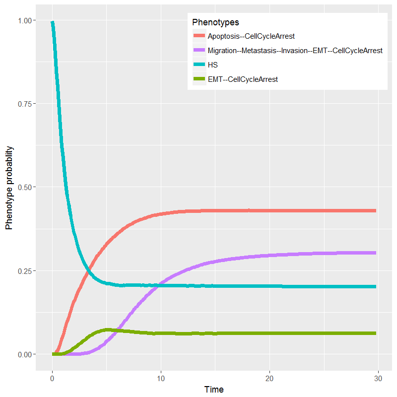<br>
B)&nbsp;&nbsp;<br>
Figure 2: Plot of the metastasis model solutions using MaBoSS. Initial conditions were chosen such that: all internal nodes had initial values set to zero and inputs nodes (<i>ECMicroenv</i>, <i>DNAdamage</i>, <i>GF</i> and <i>TGFbeta</i>) were randomly set to zero or one. A) Probabilities of one hundred trajectories of model state over continuous time; B) Pie chart of asymptotic solutions for the wild type case
</p>

This plot (Figure 2A) displays temporal evolution of the four most probable trajectories. As we can see most probable stable state is *Apoptosis* and *Cell Cycle Arrest*, followed by *Migration*, *EMT* and *Cell Cycle Arrest*, followed by the Homeostatic state (with only CDH1 active and labelled as *HS* in this figure and *<nil>* on the files) and lastly *EMT* and *Cell Cycle Arrest*. 

Other representations can be more appropriate. For instance, if only the asymptotic solution is of interest, a pie chart displaying the probabilities of the last row of the table might be more informative (Figure 2B).

The R code provided here allows full freedom in modifying the files to output. Alternatively, in the newer version of MaBoSS, MaBoSS 2.0, there are two python scripts in the environment that outputs quickly MaBoSS trajectories and MaBoSS pie charts:

	MBSS_TrajectoryFig.py ginsimout
	MBSS_PieChart.py ginsimout

## 5. Model reduction

For some analyses or depending on the size of the network, it might be necessary to reduce the model to get some clearer insight about the mechanisms involved in the processes described in the model. We propose two approaches here.

#### 1. Masking nodes reduction using GINsim

The first approach consists in reducing the network by masking some variables and propagating the rules to the target variables. 

The list of the stable states of the full detailed model is shown below:

<p align="center">

</p>

First two columns, *ECMicroenv* and *DNAdamage* are the inputs of the system and the following six are outputs: *ECM*, *Invasion*, *Migration*, *Metastasis*, *Apoptosis* and *CellCycleArrest*.

We select the variables we wish to keep in the reduced version of the model and 

Go to `Tools => Reduce model`

<p align="center">
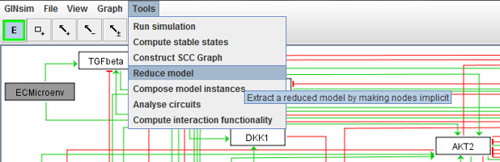
</p>

Choose the variables to suppress, nodes that we want to remove. Please bear in mind that this should not be done on self-regulated nodes.

<p align="center">

</p>

The resulting network is the following:

<p align="center">

</p>

New edges, with blue colour, represent reduced paths, combination of two or more edges in the original network.

The resulting logical rules are not written explicitly but the conditions for activations are available as a list of parameters. 

The resulting stable states can be obtained and we can see that the transfer function of inputs and outputs have been conserved, same combinations of inputs lead to same combination of outputs:

<p align="center">

</p>

#### 2. Modular reduction using BiNoM

Another way to reduce the model is by collapsing a set of neighbouring nodes into one module. 

This method is semi-manual and requires some decision-making from the modeller.

For that, we use BiNoM functionalities. The method for reduction was already presented in (ref 7), where the rationale behind choices on rules was explained. With this method, some choices of which rules are important need to be made like when both positive and negative influences are deduced from one module to another.

The obtained network with 20 nodes and 93 edges is presented below:

<p align="center">
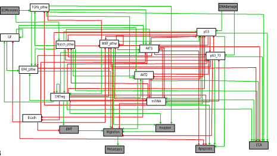
</p>
with the corresponding rules:

<table>
  <tr>
    <td>Node</td>
    <td>Rule</td>
  </tr>
  <tr>
    <td>AKT1</td>
    <td>WNT_pthw & (Notch_pthw | TGFb_pthw | GF | EMTreg) & !miRNA & !p53 & !Ecadh</td>
  </tr>
  <tr>
    <td>AKT2</td>
    <td>(TGFb_pthw | GF | Notch_pthw | EMTreg) & EMTreg & !miRNA & !p53</td>
  </tr>
  <tr>
    <td>Ecadh</td>
    <td>!AKT2 & !EMTreg</td>
  </tr>
  <tr>
    <td>WNT_pthw</td>
    <td>!Notch_pthw & !EMTreg & !miRNA & !p53 & !p63_73 & !AKT1 & !Ecadh & !WNT_pthw</td>
  </tr>
  <tr>
    <td>ERK_pthw</td>
    <td>(TGFb_pthw | Notch_pthw | GF | EMTreg) & !AKT1</td>
  </tr>
  <tr>
    <td>GF</td>
    <td>(GF | EMTreg) & !Ecadh</td>
  </tr>
  <tr>
    <td>miRNA</td>
    <td>(p53 | p63_73) & !AKT2 & !EMTreg & !AKT1</td>
  </tr>
  <tr>
    <td>Notch_pthw</td>
    <td>ECMicroenv & !p53 & !p63_73 & !miRNA</td>
  </tr>
  <tr>
    <td>p53</td>
    <td>(Notch_pthw | DNAdamage | WNT_pthw) & !AKT1 & !AKT2 & !p63_73 & !EMTreg</td>
  </tr>
  <tr>
    <td>p63-73</td>
    <td>!Notch_pthw & !p53 & DNAdamage & !AKT2 & !AKT1 & !EMTreg</td>
  </tr>
  <tr>
    <td>TGFb_pthw</td>
    <td>(Notch_pthw | ECMicroenv) & !WNT_pthw & !miRNA</td>
  </tr>
  <tr>
    <td>EMTreg</td>
    <td>(Notch_pthw | WNT_pthw | EMTreg) & !miRNA & !p53</td>
  </tr>
  <tr>
    <td>CCA</td>
    <td>(((p53 | p63_73 | (TGFb_pthw & Notch_pthw) | AKT2) & !ERK_pthw) | miRNA | EMTreg) & !AKT1</td>
  </tr>
  <tr>
    <td>Apoptosis</td>
    <td>!ERK_pthw & !AKT1 & !EMTreg & (miRNA | p63_73 | p53)</td>
  </tr>
  <tr>
    <td>EMT</td>
    <td>!Ecadh & EMTreg</td>
  </tr>
  <tr>
    <td>Invasion</td>
    <td>(TGFb_pthw & EMTreg) | WNT_pthw</td>
  </tr>
  <tr>
    <td>Migration</td>
    <td>EMT & ERK_pthw & AKT2 & Invasion & !AKT1 & !miRNA & !p63_73</td>
  </tr>
  <tr>
    <td>Metastasis</td>
    <td>Migration</td>
  </tr>
</table>


## 6. Mutant analysis

One of the reasons to be interested in model construction is the possibility to study genetic perturbations and how they affect phenotypes. As our nodes correspond to genes or sets of genes, it is easy to have an automated construction of models with perturbed genes and be able to simulate them. This allows us to be able to compare different mutant models and combinations of perturbations, thus enabling epistasis studies, and perform also robustness analyses.

The BND is meant to remain the same throughout the analysis. All modifications of the model can be done using the CFG files only and renaming the files for each modification. For this reason, right at the beginning of the analysis, we suggest to already prepare the BND file to allow the simulation of mutants, or perform robustness analyses, by introducing some external parameters that can be controlled from the CFG file. For each variable, we create new parameters that account for overexpression or deletion of the node. If there are kept to 0 (or FALSE), the modifications will be ignored. To simulate the mutations, the parameters will be set to 1 (or TRUE).

### 1. Simulating mutants

We propose two means to facilitate the creation of these files:

* With the perl script: `MBSS_MutBndCfg.pl`, available on MaBoSS webpage: [MaBoSS webpage](http://maboss.curie.fr/) or directly available from the environment. 
For that, you need to type: 

	`MBSS_MutBndCfg.pl ginsimout.bnd ginsimout.cfg 'VAR1 VAR2 …'`

Two new files are created with the extension \_mut

* With the script: `BND_CFG_modif.sh`
For that, we need to define the outputs of the model in the file listOut.txt and the inputs in file listIn.txt, one output or input per line. Then, the CFG and BND files are modified using `BND_CFG_modif.sh`. The script changes these files (with the new parameters for simulating mutants) and keeps the original ones with original suffix: ginsimout\_original.bnd and ginsimout\_original.cfg. The script also optimizes the simulation parameter values (maximum number of steps, number of trajectories, etc.).

### 2. Predicting genetic interactions

We use MaBoSS in order to explore an epistasis study of the genes in our network. For this, we need several files, such as: 

* BiNoM.jar
* MaBoSS executable (MaBoSS for UNIX and MaBoSS.exe for Windows)
* VDAOEngine.jar
* BND file
* CFG file
* `1_generating_mutants.sh` script
* `2_running_MaBoSS.sh` script
* `3_results_table.sh` script
* `4_epistasis_study.sh` script
* `1-4_epistasis.sh` script

We run the analysis in four parts: firstly, we generate all mutants; secondly, we run MaBoss instances for these; thirdly, we bundle the results on a table and finally, we analyse genetic interactions among mutants.

#### 1. Generating all desired mutants

We propose to simulate all single and double mutants. For that, we start by creating the CFG files corresponding to the different individual knock-out (KO) and overexpression (or ectopic expression, OE) mutants for each node and their combination. To do so, we use *MaBoSSConfigurationFile* embedded in BiNoM JAR file. 

At the end, a script (BAT and SH) is created in order to run MaBoSS simulations with all these files. The command line to perform this analysis is:

	java -cp ../../../lib/BiNoM.jar fr.curie.BiNoM.pathways.MaBoSS.MaBoSSConfigurationFile 
	-c ./ginsimout.cfg -b ./ginsimout.bnd

We also provide the small script: `1_generating_mutants.sh`

Here, -cp is the location of the JAR file, -c is the CFG file location and -b is the BND file location. Other optional arguments are:

	-single 	only single mutants
	-double		only double mutants
	-onlyko		only studies KO mutants, does not study OE mutants
	-exclude PHENOTYPE, PHENOTYPE	excludes study of given phenotypes

#### 2. Running MaBoSS

The script:

	2_running_MaBoSS.sh 

executes the running script SH file in order to have one MaBoSS run for each mutant combination. 

#### 3. Building a table with all MaBoSS results

The script `3_results_table_norm.sh` goal is to build a table that gathers all the results from all the ProbTraj files done by the MaBoSS runs. For this we use MaBoSSProbTrajFile function from BiNoM JAR file.

The command that performs this analysis is:

	java -cp '../../../lib/BiNoM.jar:../../../lib/VDAOEngine.jar' fr.curie.BiNoM.pathways.MaBoSS.MaBoSSProbTrajFile 
	-maketable -folder ginsimout_mutants/ -prefix ginsimout -out ginsimout.xls

Where `-cp` is the location of the JAR files, `-maketable` is the command to build the results’ table (in a tab-delimited file and a DAT ViDaExpert table file), `-folder` is the location of the folder with ProbTraj files, `-prefix` is the name of the files’ prefix (usually a descriptive name for the model) and `-out` is the desired output file name.

4. Normalizing MaBoSS results and analysing genetic interactions

The script `4_epistasis_study.sh` goal is to normalize the results obtained with MaBoSS using MaBoSSProbTrajFile function from BiNoM JAR file.

The command for this is:

	java -cp '../../../lib/BiNoM.jar:../../../lib/VDAOEngine.jar' fr.curie.BiNoM.pathways.MaBoSS.MaBoSSProbTrajFile
	-normtable -table ginsimout.xls

Where `-cp` is the location of the JAR files, `-normtable` is the normalization command that filters lower bounds of 1% in the probability table and `-table` is the name of the data table that results from `-maketable` command. This command will build a new table called ginsimout\_norm.xls that we will need to perform the epistasis study.

Additionally, we can use this normalization step to bundle together phenotypes that are very similar using the `-mergedphenotypes` flag. We can add phenotypes into different groups such as:

	java -cp '../../../lib/BiNoM.jar:../../../lib/VDAOEngine.jar' fr.curie.BiNoM.pathways.MaBoSS.MaBoSSProbTrajFile -normtable 
	-mergedphenotypes "ECM1=ECMicroenv/EMT+ECMicroenv/EMT/GF+ECMicroenv/EMT/GF/TGFbeta+ECMicroenv/EMT/TGFbeta+ECMicroenv/GF+ECMicroenv/GF/TGFbeta;
	Migration1=ECMicroenv/Migration/Metastasis/Invasion/EMT/GF/TGFbeta+Metastasis+ECMicroenv/EMT/CellCycleArrest/GF" 
	-table ginsimout.xls

This allows researchers to be able to bundle together phenotypes that are very similar and thus are supposed to have similar epistatic properties or phenotypes that are part of the same stable states family (for instance all the phenotypes that lead to *Apoptosis* or *CellCycleArrest*). 

Once we have normalized the results and bundled together some phenotypes, we can study genetic interactions among mutants using MaBoSSProbTrajFile function from BiNoM JAR file. This is also done by the `4_epistasis_study.sh` script.

The command for this is:

	java -cp '../../../lib/BiNoM.jar:../../../lib/VDAOEngine.jar' fr.curie.BiNoM.pathways.MaBoSS.MaBoSSProbTrajFile
	-makeinter -table ginsimout_norm.dat -phenotype CellCycleArrest -phenotype_short CCA -out ginsimout >epistasis_summary.txt

Where `-makeinter` is the command to build the table of interactions with correlation values and alpha values (look at a previous paper (ref 8) for details), `-table` is the name of the data table that results from `-normtable` command (only DAT file is allowed), -phenotype is the name of the phenotype in the DAT file (in this case, CellCycleArrest), -phenotype\_short is the short name that you want to assign to this phenotype in the output file (in this case, CCA) and `-out` is the prefix of the output files that the command will generate.

This command outputs different kind of files:

* edges, a Cytoscape format file with the epistasis values between combinations of mutants
* nodes, a Cytoscape format file with wild-type phenotype changes in in single mutants
* epi, a descriptive table with the best epistasis results (EPS\_BEST in this case)

More information on how the epistasis scores are calculated can be found in a previous paper (ref 8). All edges, nodes and epi files, as well as the folder with mutant files and MaBoSS results will be located at `ginsimout_epistasis` folder. As an example, we will study the `ginsimout_Metastasis_edges_selected_stringent3.txt` file that corresponds to the combined phenotype of *Migration/Metastasis/Invasion/EMT/CellCycleArrest* to find what combinations have epistatic effect on this phenotype. For this, we can load this file in our favorite spreadsheet to look for the epistatic combinations.

Before analysing the results of the epistasis we need to understand how these values were computed. This file shows the results of the following equation for each gene pairs (equation 2 in ref 8):

<p align="center">
		(1)
</p>

Where   and  are phenotype 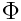 fitness values of single gene defects, 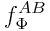 is the phenotype  fitness of the double mutant, and  is one of the four functions:


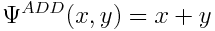 		(additive)

		 (log)

		 (multiplicative)

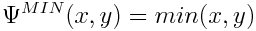 		(min)

To choose the best definition of  , the Pearson correlation coefficient was computed between the fitness values observed in all double mutants and estimated by the null model (more information on ref 9). Regarding  fitness value, to a given phenotype ,  represents deleterious, 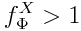 beneficial and 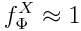neutral mutation.

In this `_edges_selected_stringent3.txt` file, the first columns are descriptions of the interactors and their type of mutation (knock out or overexpression), then we have the fitness of each interactor and the fitness of the double mutant, then we have the                of each one of the four functions as well as the best one and its normalization (for details on this selection, please refer to ref 9). The last three columns will be the ones that interest us the most: INEQUALITY, which is the comparative of the fitness of the wild type and the three mutants; INEQ\_TYPE, which is the type of interaction among the four fitnesses and INEQ\_DIR, which is an indicative of which mutant is dominating the epistasis.

We are interested in the combined phenotype of *Migration/Metastasis/Invasion/EMT/CellCycleArrest*, having done the epistasis study of this combined phenotype, we open `ginsimout_Metastasis_edges_selected_stringent3.txt` file and sort the file by the INEQ\_TYPE column and identify 22 pairs of genes that are synergistic (these genetic interaction classes have been classified as: "suppressive", "epistatic", "conditional", "single-nonmonotonic", "additive", "double-nonmonotonic", "noninteractive", "synthetic", and "asynthetic", more on this on ref 8 and 9). We find 13 epistatic pairs and, filtering out the genetic alterations of input nodes, we find 6 nodes pairs that include the combinations of AKT2 gain of function with SNAI1, SNAI2 and TWIST1 gain of functions and NICD gain of function with SMAD, SNAI1 and TGFbeta gain of functions. All of them have an INEQUALITY of the type: WT<B<A=AB, which is representative of a double mutant that have the same phenotype than one of the mutants (A in this case), and both of them have an increased phenotype on the B mutant. B, in its turn, has an increased phenotype than the wild type.

Then, using the code found in `Analyses_of_genetic_interactions.R` file we can use PCA function from FactoMineR package to study mutants variability. The combined PCA plot shows the first two PCA dimensions and the projections of the wild type, single and double mutants (knock out or overexpression). This plot also shows the variable factors’ vectors (the sets of phenotypes) in order to analyse which variable is the main driver of the knock out change when comparing it to the wild type.

<p align="center">
A)&nbsp;&nbsp;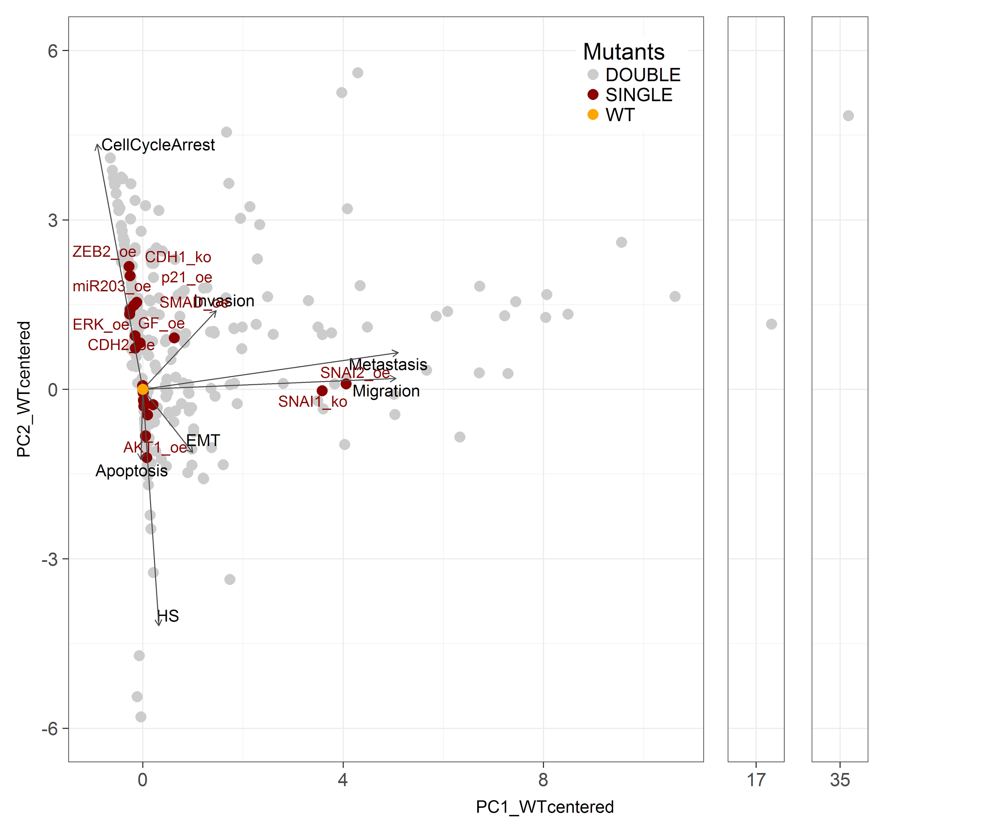<br>
B)&nbsp;&nbsp;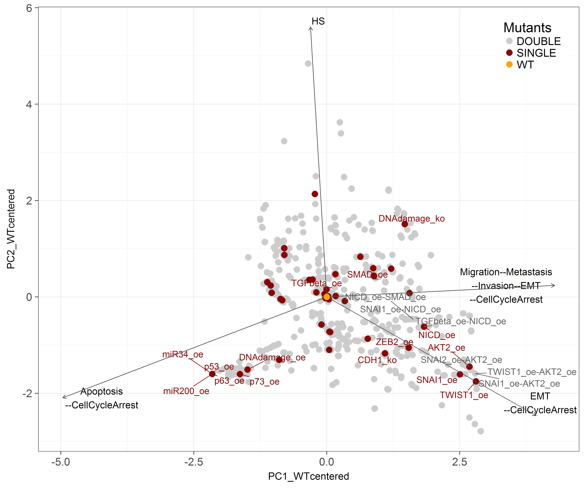<br>
Figure 3: PCA bi-plot of the probability profiles over the set of studied phenotypes. The probabilities of all overexpressed (oe) or knock-out (ko) single (red) and double (grey) mutants are plotted with the wild type (WT - yellow)) as the center of origin. The arrows show the contribution of the four phenotypes to each single or double mutant. In A) we have plotted the phenotype probabilities projection to the single phenotypes (<i>HS</i>, <i>Apoptosis</i>, <i>EMT</i>, <i>Invasion</i>, <i>Migration</i>, <i>Metastasis</i>, <i>CellCycleArrest</i>), while in B) we have plotted the phenotype probabilities projection to the meta-phenotypes that we have discussed in depth in this tutorial.
</p>

In Figure 3A we see that SNAI2 overexpression and SNAI1 knock out are the single mutants that move the wild type state farthest towards Metastasis and Migration phenotypes (dark red dots). In fact, the combination of SNAI1\_ko and SNAI2\_oe is the first facet of Figure 3 around 17 of WT-normalized PC1. Also, the second facet around 35 of WT-normalized PC1 is the combination of SNAI1\_ko and AKT2\_oe.

This combination is an example of genetic interaction as AKT2\_oe single mutant is near WT values (label not shown), but once it is combined with SNAI1\_ko their projection on PC1 are drastically changed. This can be studied looking at the files from the Metastasis (only) phenotype , specifically at `Metastasis_pure_edges_selected_stringent3.txt`. Here we can see that this double mutant phenotype outstands as a genetic interaction, even though the type of genetic interaction is asynthetic, in the form of A=B=AB<WT.

In Figure 3B we can identify the 6 epistatic pairs that we have discussed previously of the combinations of AKT2 gain of function with SNAI1, SNAI2 and TWIST1 gain of functions and NICD gain of function with SMAD, SNAI1 and TGFbeta gain of functions. We can visually understand the epistasis of these combinations by tracing the projections of their single gene alterations. For instance, if we look at the combined effect of AKT2 gain of function with SNAI1 or TWIST1 gain of functions, we see that the combinations bring the double mutant closer to the combined Migration phenotype and further from the WT.

#### Robustness analysis of genetic interactions with respect to the phenotype probability

Using the normalized file `ginsimout_norm.xls` we can explore the robustness of the genetic interactions with respect to the phenotype probabilities. This is a complementary analysis to the one done on the file `ginsimout_EMT_epi.txt`, as now we will not only see which pairs have an epistatic effect, but if this effect is positive or negative on a given phenotype. For this, we can run the R code found in file `Analyses_of_genetic_interactions.R`.

For example, we are particularly interested in the combined phenotype of *Migration/Metastasis/Invasion/EMT/CellCycleArrest*. As we can see in Figure 2, the wild type probability at the end of the MaBoSS run for this phenotype is 30.4%. In Figure 4, we have plotted this phenotype’s probability distribution across single and double mutants. We can see that 452 (22% of total) mutant combinations do not vary the phenotype probability to that of the WT. There are 938 (45.77% of the total) mutant combinations that abolish the phenotype probability to 0. Furthermore, there are 5 combination of mutations that increase this phenotype’s probability more than three times that of the WT.

Looking closely at the mutations that shift the phenotype’s distribution to 0, we find that many of those combinations are knock outs of gene that are necessary for the activation of the Migration node, which is the node that requires more activated genes in the network. Additionally, we find overexpression of genes that are anti-migratory or pro-apoptotic.

Likewise, if we look at the combinations of mutations that increase this phenotype’s probability, we find that they are *NICD\_oe* with *AKT2\_oe*, *SNAI2\_oe*, *p73\_oe*, *ECMicroenv\_oe* or *p53\_ko*. These are mutants with overexpressed pro-migratory genes, with high levels of pro-migratory microenvironment signals or with a pro-apoptotic gene knocked out.

<p align="center">
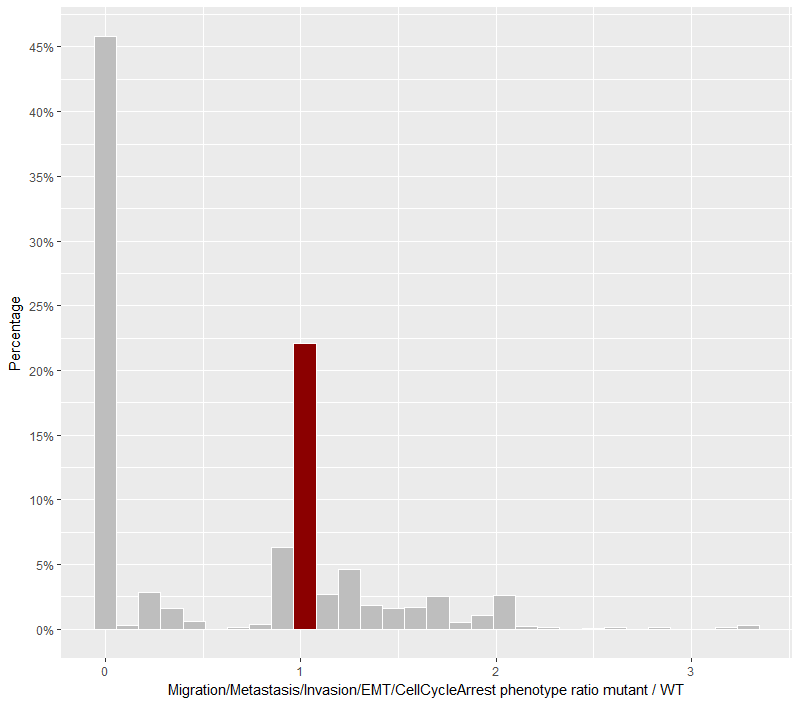<br>
Figure 4: <i>Migration/Metastasis/Invasion/EMT/CellCycleArrest</i> phenotype distribution across all single and double mutants. Bin where wild type value is found has been marked with dark red colour.
</p>

All the figures for all the phenotypes of interest can be found in Supplementary figure 2.

### 3. Robustness analysis of logical gates

For this, we need several files, such as: 

* BiNoM.jar
* MaBoSS executable (MaBoSS for UNIX and MaBoSS.exe for Windows)
* VDAOEngine.jar
* BND file
* CFG file
* `1_generating_variants.sh` script
* `2_running_MaBoSS.sh` script
* `3_results_tables.sh` script
* `1-3_logical.sh` script

Similarly to the "Predicting genetic interactions" section, we first built model variants, then simulate them, gather their results and, finally, analyse them.

1 Generating all desired mutants

The goal is to build a folder with files corresponding to the different logical gates mutants for each node formula. We built variant models with 3 modifications: (1) one change of a logical operator in one logical rule, (2) two changes in the same logical rule, or (3) one single change in two different logical rules. In machine power allows, of course, more changes can be envisaged. The total number of different models that are generated in 8001. For this, we use MaBoSSBNDFile script from BiNoM JAR file. At the end, this script also builds a script (BAT and SH) to run MaBoSS simulations with all these files. The command line to perform this analysis is:

	java -cp ../../../lib/BiNoM.jar fr.curie.BiNoM.pathways.MaBoSS.MaBoSSBNDFile 
	-c ./ginsimout.cfg -b ./ginsimout.bnd -level 2

Where -cp is the classpath or location of the JAR file, -c is the CFG file location and -b is the BND file location. Several paths to CFG files can be glued together using '+' symbol and, in this case, several command lines per one model variant will be generated. Other optional arguments are:

	-level		can be either 1 (for making only one modification in a logical rule) 
			or 2 (for making 2 modifications). Default value is 1.

	-several	modifier for -level 2 option. If specified, then two logical rules can be 
			applied for two different rules, if not then two modifications will be applied 
			only inside the same rule.

In our ginsimout case, we have 360 variants if we look for level 1 modifications, over 4 thousands if we look for level 2 and over 64 thousands if we look for level 2 and several. For the sake of clarity, we will consider level 2 without the several flag.

The result of this command line application is a folder named `{BND_file_name}_mutants_logics` that bears all BND model variants, run.bat and run.sh files for running the MaBoSS calculations and descriptions.txt file containing descriptions of the generated model variants.

This can be run with the script `1_generating_variants.sh`.

2 Running MaBoSS instances

The goal is to execute the running script SH or BAT file in order to have one MaBoSS run per mutant combination, such as:

	./run.sh

In the case of using the script on Cygwin in Windows OS, there is a step after the MaBoSS runs where we build the fixed points files. In Unix, these are build automatically.

3  Gathering the results in tables and analyse mutants

We will use the script `3_results_tables.sh` to organize the results of MaBoSS and the mutants’ stable states.

* Build a table with all MaBoSS results 

The goal is to build a table that gathers all the results from all the ProbTraj files done by the previous MaBoSS runs. For this we use MaBoSSProbTrajFile function from BiNoM JAR file.

The command line to perform this analysis is:

	java -cp '../../../lib/BiNoM.jar:../../../lib/VDAOEngine.jar' fr.curie.BiNoM.pathways.MaBoSS.MaBoSSProbTrajFile 
	-makelogicmutanttable -folder ./ginsimout_mutants_logics/ -prefix ginsimout 
	-out ginsimout.xls -description ./ginsimout_mutants_logics/descriptions.txt

Where -classpath is the location of the JAR files, -makelogicmutanttable is the command to build the results’ table (in a tab-delimited file and a ViDaExpert table file), -folder is the location of the folder with ProbTraj files, -prefix is the name of the files’ prefix (usually a descriptive name for the model) and -out is the desired output file name.

This command outputs the file ginsimout.xls that describes all variants final phenotypes.

* Build a table with all stable states for all mutants and calculate stable states’ frequencies and Hamming distance among stable states

First, the goal is to build a table that gathers all the final stable states and their frequencies from all the StatDist files done by the previous MaBoSS runs. For this we use MaBoSSStatDistFile function from BiNoM JAR file.

The command line to perform this analysis is:

	java -cp '../../../lib/BiNoM.jar:../../../lib/VDAOEngine.jar' fr.curie.BiNoM.pathways.MaBoSS.MaBoSSStatDistFile 
	-maketable -folder ginsimout_mutants_logics/ -prefix ginsimout

Where -cp is the location of the JAR files, -maketable is the command to build the table with all final stable states reached by each mutant (in a tab-delimited file and a ViDaExpert table file), -folder is the location of the folder with StatDist files and -prefix is the name of the files’ prefix (usually a descriptive name for the model).

This command builds two tab-delimited files, one with name `{prefix}_dist_mutants_count.txt` where each stable state for each mutant can be found and `{prefix}_dist_mutants_Hamming.txt` that describes all stable states and their Hamming distance to the closest wild type stable state. 

#### Robustness analysis of logical gates with respect to the phenotype probability

Using the file ginsimout.xls we can explore the robustness of the rules with respect to the phenotype probabilities. For this, we can run the R code found in file `Analyses_of_logical_gates.R`.

For example, we continue to be particularly interested in the combined phenotype of *Migration/Metastasis/Invasion/EMT/CellCycleArrest*. As we can see in Figure 2, the wild type probability at the end of the MaBoSS run for this phenotype is 30.4%. In Figure 5, we have plotted this phenotype’s probability distribution across single and double logical gates mutants. We can see that 2913 combinations (66.4% of total) of logical operator variations do not vary the phenotype probability to that of the WT. There are 340 combinations (7.75% of the total) of logical gates variations combinations that abolish the phenotype probability to 0. Furthermore, there are 222 combinations (5% of the total) of variations that increase this phenotype’s probability more than 1.5 times that of the WT and 11 combinations (0.25% of the total) of variations that increase this phenotype’s probability more than 1.7 times that of the WT. 

Looking closely at the logical gates variations that shift the phenotype’s distribution to 0, top three node whose rules need to be carefully looked upon are AKT1 and p53 (Figure 6). Changing some logical operator of these nodes’ rule will likely abolish an otherwise pro-migratory phenotype. Likewise, if we look at the 222 combinations of logical gates variations that increase this phenotype’s probability more than 1.5 times that of the WT, we find combinations of three nodes’ rule logical operators: AKT1, AKT2 and NICD and if we look at the 11 combinations of logical gates variations that most increase this phenotype’s probability, we find that they are all part of the NICD node’s rule logical operators. Meaning that allowing a less strict activation of this node will likely cause a false positive pro-migratory phenotype. A particular attention needs to be given to these variables whose rules need to be carefully constrained and the literature in which they are based be studied in special detail.

Note that AKT1 is a node in which changing some logical rules may abolish the metastatic phenotype, while changing others (obviously, in opposite sense) will increase this phenotype.

All the figures for all the phenotypes of interest can be found in Supplementary figure 1.

<p align="center">
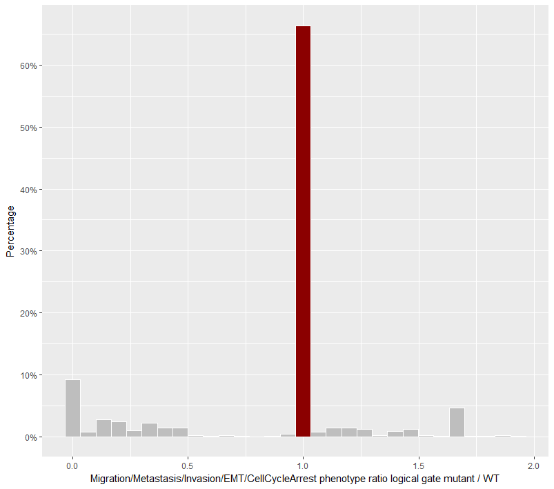<br>
Figure 5: <i>Migration/Metastasis/Invasion/EMT/CellCycleArrest</i> phenotype probability distribution across all mutants for logical gates. Bin where wild type value is found has been marked with dark red colour.
</p>

<p align="center">
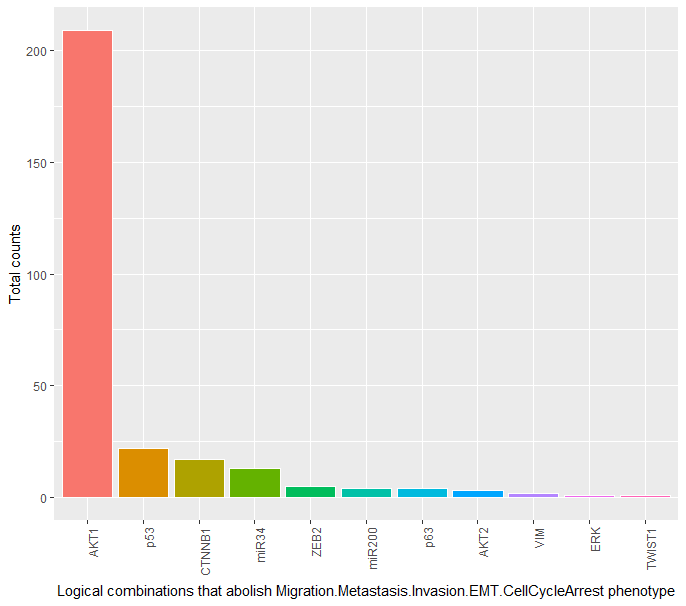<br>
Figure 6: Distribution of logical combinations that reduce <i>Migration/Metastasis/Invasion/EMT/CellCycleArrest</i> phenotype probability to zero.
</p>

#### Robustness analysis of logical gates with respect to the stable states

Using the file `ginsimout_dist_mutants_Hamming.txt` we can explore the frequency of stables states and their distance to the wild type probabilities using the R code found in file `Analyses_of_logical_gates.R`.

The wild type is composed of 9 stable states showing 4 different phenotypes: *Homeostasis*, *Apoptosis*, *EMT* and *Metastasis*. By listing all the stable states for all the 4387 variants, we observe that in average, the variants have also around 8 or 9 stable states. Note that the 8 or 9 stable states of the variants might not be the same as the wild type. Among all these stable states, we searched for differences between the stable states of the wild type to the stable states of the variants. We computed the Hamming distance of all the variants’ stable states to the 9 stable states of the wild type. 

In our model, we have found 38922 stables states of all mutants and most of them (25742, 66.1% of the total) are the same than the 9 stable states from the WT (distance to WT stable states = 0). The stable states that differ the most (distance to WT stable states = 12) are 37 different variations of CTNNB1 or NICD logical rules that represent 0.09% of the total.

<p align="center">
<br>
Figure 7: Stables states counts present in all mutants combinations. All 38922 stables states of all mutants have been ordered by their Hamming distance to the closest WT stable states and their abundances have been counted.
</p>

Furthermore, if we filter by unique stable states, we have found 209 stable states and most of them (85, 40.7% of the total) have Hamming distance of 1 to any of the 9 WT stable states (that represent 4.3% of the total with Hamming distance 0).

<p align="center">
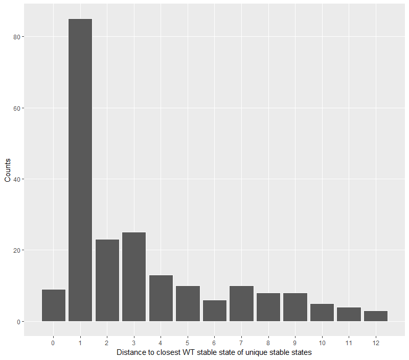<br>
Figure 8: Unique stable states counts present in all mutants combinations. 209 unique stables states of all mutants have been ordered by their Hamming distance to the closest WT stable states.
</p>

Note that in this analysis we are looking at stable states and we are ignoring the possible cyclic attractors, but it can still be informative to study the divergence from the wild type stable states.

## 7. Using the model as a scaffold for data integration

### Mapping data onto modular network using ROMA

We used expression data from eight primary colon cancer samples ([GSE56386](http://www.ncbi.nlm.nih.gov/sites/entrez?db=gds&term=GSE56386[Accession]&cmd=search)), divided into a set of 4 tumors responding to cetuximab therapy, and 4 tumours non responding. 

We tested target gene sets selected from MSigDB (PMID:16273092) database together with several gene sets assembled by us from external publications. The description of the resulting 105 gene sets is available as supplementary GMT file. 

To run ROMA, we set the parameters as follows in the .bat file:

	java -cp ../../../lib/ROMA_v1_0.jar fr.curie.ROMA.ModuleActivityAnalysis -dataFile data_EMT_sorted.txt 
	-moduleFile Main_Pathway_File.gmt -typeOfModuleFile 1 -outputFolder crc_cetuximab_MainPath 
	-robustPCA 1 -numberOfPermutations 1000 

where the parameter -typeOfModuleFile 1 specifies that the we provided a module file GMT with weights and -robustPCA 1 requires to compute PCA using leave-one-out-based removal of outliers. The output folder contains the `moduletable_simple.txt` file with the matrix of activity values of each tested module in each sample. These have been used to compute the mean activity score in the two groups for the modules included in the model.

<p align="center">
A)&nbsp;&nbsp;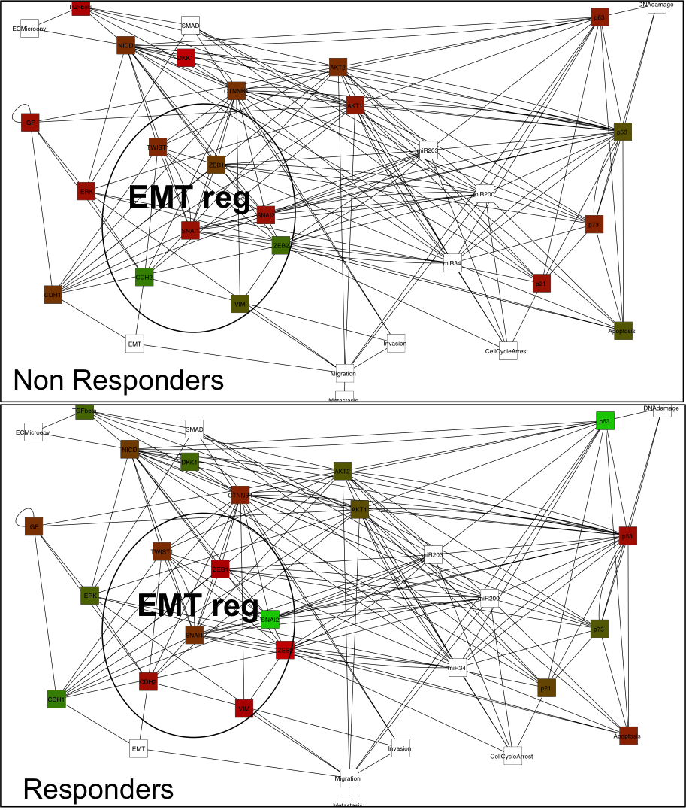<br>
B)&nbsp;&nbsp;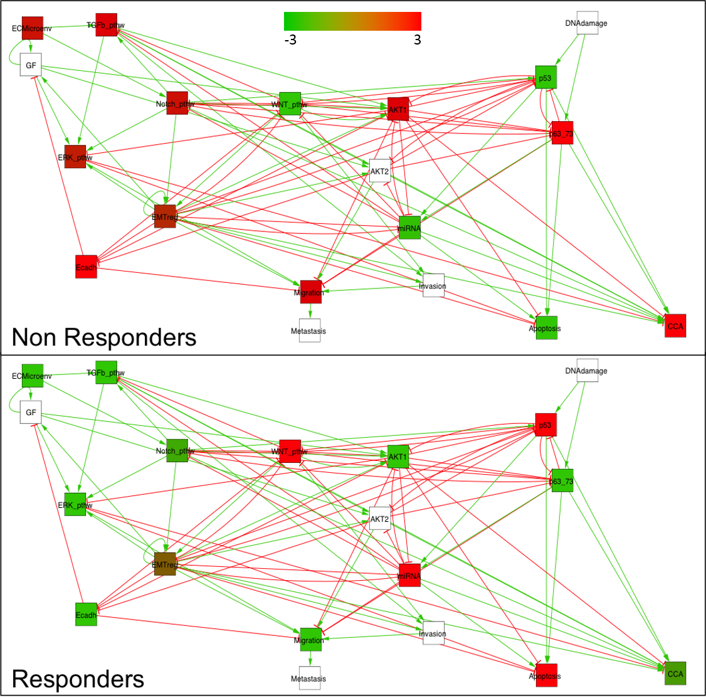<br>
Figure 9: A) gene-wide model with data, B) module-wide model with data
</p>

Note that this analysis could also be achieved using: [R-based rROMA](https://github.com/sysbio-curie/rRomaDash) 

## 8. Using data as priors of model construction

### Identifying interesting modules from data with ROMA

We use ROMA software to perform the following analysis (ref 10). 

We select gene sets from MSigDB (ref 11), KEGG (ref 12), Reactome (ref 13) and ACSN (ref 14) to identify the pathways that are overdispersed in the dataset. A collection of 1135 gene sets were selected and are available at the pipeline [github repository](https://github.com/sysbio-curie/Logical_modelling_pipeline/tree/master/scripts/8b%20Using%20data%20as%20priors%20of%20model%20construction%20-%20ROMA).

To run ROMA, we use the R script: `R_script_for_ROMA.R`.

For this analysis, we did not specify the use of a weighted GMT file, so the algorithm considers a default unweighted GMT format.

In this example, we focused on KEGG database only. ROMA detected 51 differentially activated/inactivated gene sets (t-test, p-value <0.05) revealing major biological pathways contributing to the cetuximab response. 

When performing ROMA analyses on the whole GMT provided in [github address](https://github.com/sysbio-curie/Logical_modelling_pipeline/tree/master/scripts/8b%20Using%20data%20as%20priors%20of%20model%20construction%20-%20ROMA), we find consistent results with previous analyses, such as Notch and Wnt activation in aggressive tumours non responsive to therapy, caspase activation in tumours responsive to therapy. 

Moreover, we identified activation of HSP27 and CARM1 pathways, potentially involved in the tumour aggressiveness.

<p align="center">


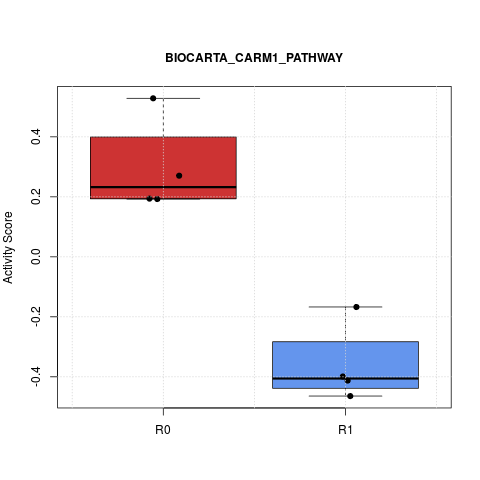

<br>
Figure 10: Selected results of ROMA on expression data from eight primary colon cancer samples, responding (R1) and not responding (R0).
</p>

### Prioritization of genes for constructing the model with Lemon-Tree

We used the same dataset of colon primary tumors as described in the previous paragraph ([GSE56386](http://www.ncbi.nlm.nih.gov/sites/entrez?db=gds&term=GSE56386[Accession]&cmd=search)) to build a module network with the [Lemon-Tree](https://github.com/eb00/lemon-tree) software (ref 15). The process to install the software is described in the Lemon-Tree [tutorial](https://github.com/eb00/lemon-tree/wiki/Tutorial).

Prior to run the code, we have centered the expression values of each row of the matrix (i.e. subtracting the mean). We have also eliminated each row having a standard deviation value below 0.6, to remove genes having "flat" expression profiles. We name this dataset data\_reduced.txt. 

Then we cluster gene expression profiles using Lemon-Tree Gibbs Sampling procedure with the command:

	java -jar lemontree.jar -task ganesh -data_file ../data/data_reduced.txt 
	-output_file cluster1.txt 

The clustering solution output is contained in the file cluster1.txt. We then repeat this command at least 10 times, to generate 10 (slightly) different clustering solutions (cluster2.txt, cluster3.txt, etc.).

From this 10 solutions, we then create a robust clustering solution with the command:

	java -jar lemontree.jar -task tight_clusters -data_file data_reduced.txt 
	-cluster_file cluster_file_list.txt -output_file tight_clusters.txt -node_clustering true

In this command, the file `cluster_file_list.txt` is just a text file listing all the clustering solutions files generated at the previous step. The file `tight_clusters.txt` contains the robust clusters. It can be easily constructed with the command:

	ls cluster*.txt > cluster_file_list.txt

Now we will assign "regulators" for each one of the clusters, taking as input the list of genes of the model that we want to prioritize and the robust clustering solution created at the previous step:

	java -jar lemontree.jar -task regulators -data_file data_reduced.txt 
	-reg_file reg_emt.txt -cluster_file tight_clusters.txt -output_file reg_model

The output file reg\_model.topreg.txt contains the top regulators (i.e. genes with scores that are ranked within the top 1% of all regulators). A given gene can be assigned to multiple clusters. We further refine this list by calculating the sum of all individual scores for each gene. This will give a higher weight to the genes that are indeed assigned to more than one cluster ("hub" regulators). Finally, the list is ranked by decreasing global score. We can now use this list to prioritize genes for the construction of the model, by selecting for instance genes that are within the the top 20 of the list, in combination with other criteria. 

	python sum_and_sort.py reg_model.topreg.txt | head -n 20

The ranking of the genes means that genes that have the strongest link to the module genes in terms of similarity of profiles are selected. In other words, those genes are more likely to have a real functional link to the modules. In our model and using this data, the results suggests that top regulator genes such as CDC42SE1, MKNK1 and FGFR3 should be part of the model in order to build a specific colon cancer model that explains differential cetuximab response.

## References:

1.	Mi H, Schreiber F, Moodie S, et al. Systems Biology Graphical Notation: Activity Flow language Level 1 Version 1.2. J. Integr. Bioinforma. 2015; 12:265

2.	Le Novère N, Hucka M, Mi H, et al. The Systems Biology Graphical Notation. Nat. Biotechnol. 2009; 27:735–741

1. Cohen DPA, Martignetti L, Robine S, et al. Mathematical Modelling of Molecular Pathways Enabling Tumour Cell Invasion and Migration. PLoS Comput Biol 2015; 11:e1004571

1. Flobak Å, Baudot A, Remy E, et al. Discovery of Drug Synergies in Gastric Cancer Cells Predicted by Logical Modeling. PLOS Comput. Biol. 2015; 11:e1004426

2. Stoll G, Viara E, Barillot E, et al. Continuous time Boolean modeling for biological signaling: application of Gillespie algorithm. BMC Syst. Biol. 2012; 6:116

3. Stoll G, Caron B, Viara E, et al. MaBoSS 2.0: an environment for stochastic Boolean modeling. Bioinformatics 2017; 33:2226–2228

3.	Zinovyev A, Viara E, Calzone L, et al. BiNoM: a Cytoscape plugin for manipulating and analyzing biological networks. Bioinforma. Oxf. Engl. 2008; 24:876–877

4. Calzone L, Barillot E, Zinovyev A. Predicting genetic interactions from Boolean models of biological networks. Integr Biol. 2015;7: 921–929. doi:10.1039/C5IB00029G

5. Drees BL, Thorsson V, Carter GW, Rives AW, Raymond MZ, Avila-Campillo I, et al. Derivation of genetic interaction networks from quantitative phenotype data. Genome Biol. 2005;6: R38. doi:10.1186/gb-2005-6-4-r38

6. Martignetti L, Calzone L, Bonnet E, Barillot E, Zinovyev A. ROMA: Representation and Quantification of Module Activity from Target Expression Data. Front Genet. 2016;7: 18. doi:10.3389/fgene.2016.00018

7. Subramanian A, Tamayo P, Mootha VK, et al. Gene set enrichment analysis: a knowledge-based approach for interpreting genome-wide expression profiles. Proc. Natl. Acad. Sci. U. S. A. 2005; 102:15545–50

8.	Kanehisa M, Goto S, Sato Y, et al. KEGG for integration and interpretation of large-scale molecular data sets. Nucleic Acids Res. 2012; 40:D109–D114

9.	Croft D, Mundo AF, Haw R, et al. The Reactome pathway knowledgebase. Nucleic Acids Res. 2014; 42:D472–D477

10.	Kuperstein I, Bonnet E, Nguyen H-A, et al. Atlas of Cancer Signalling Network: a systems biology resource for integrative analysis of cancer data with Google Maps. Oncogenesis 2015; 4:e160

11.	Bonnet E, Calzone L, Michoel T. Integrative Multi-omics Module Network Inference with Lemon-Tree. PLOS Comput Biol. 2015;11: e1003983. doi:10.1371/journal.pcbi.1003983
